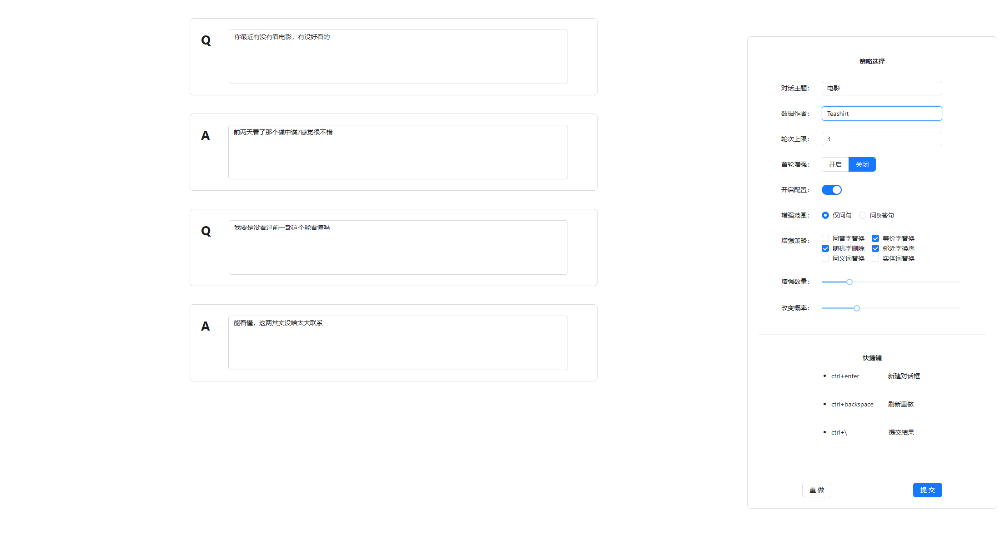
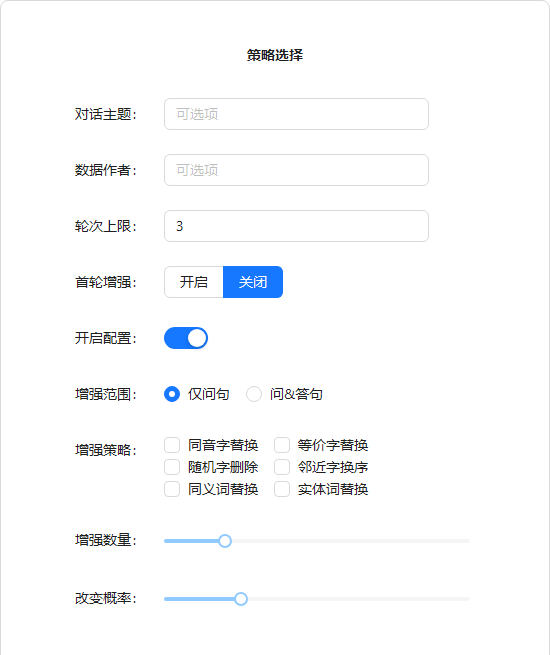

# 中文对话数据增强工具
Dialog Chinese Data Augmentation 中文对话数据增强工具

本项目的核心库`dlgcda`是对[nlpcda: 一键中文数据增强包](https://github.com/425776024/nlpcda)的二次封装

`dlgcda`的相关改动，影响，配置以及使用说明详见[dlgcda: README.md](https://github.com/teashirtt/dialog-cda-tool/blob/master/dlgcda/README.md)

---


## 介绍

- `中文对话数据增强工具`旨在帮助开发者快速构建自定义的，带有数据增强的中文对话数据集
- 本项目提供完整的前端UI界面和后端功能以及丰富的数据增强策略配置选项


## 示例

- 原对话

```
你最近有没有看电影，有没好看的
前两天看了那个碟中谍7感觉很不错
我要是没看过前一部这个能看懂吗
能看懂，这两没啥太大联系
```

- 增强后

```json
{
  "14:21:54": {
    "title": "电影",
    "author": "Teashirt",
    "data": [
      [
        {
          "Q": "你最近有没有看电影，有没好看的",
          "A": "前两天看了那个碟中谍7感觉很不错"
        },
        {
          "Q": "我要是没看过前一部这个能看懂吗",
          "A": "能看懂，这两其实没啥太大联系"
        }
      ],
      [
        {
          "Q": "你最近有没有看电影，有没好看的",
          "A": "前两天看了那个碟中谍7感觉很不错"
        },
        {
          "Q": "我邀是没看果牵壹部折個会看能嘛",
          "A": "能看懂，这两其实没啥太大联系"
        }
      ],
      [
        {
          "Q": "逆最进有没有看点影，有没好看地",
          "A": "前两天看了那个碟中谍7感觉很不错"
        },
        {
          "Q": "我枚是要看果牵一部折個能看懂吗",
          "A": "能看懂，这两其实没啥太大联系"
        }
      ],
      [
        {
          "Q": "你有近最没有看电影，有没好看的",
          "A": "前两天看了那个碟中谍7感觉很不错"
        },
        {
          "Q": "我没是要瞧过前1部这个懂瞧懂嚒",
          "A": "能看懂，这两其实没啥太大联系"
        }
      ]
    ]
  }
}
```


## 指南

#### 部署

- 配置`dlgcda`环境

```
cd dlgcda
pip install -r requirements.txt
python setup.py install
```

- 启动`Vue`前端 -- 默认端口`5100`

```
cd frontend
npm run dev
```

- 启动`FastApi`后端 -- 默认端口`5200`

```
cd backend
pip install -r requirements.txt
python script.py
```

#### 使用



- 先进行相关配置，然后使用对话框进行数据构建并提交，提交数据会以`JSON`格式保存在后端项目的`data`目录下
- 快捷键支持


| 快捷键           | 功能       |
| ---------------- | ---------- |
| `ctrl+enter`     | 新建对话框 |
| `ctrl+backspace` | 刷新重做   |
| `ctrl+\`         | 提交结果   |

- 提交规则
  - 对话不能以问句框（Q）结尾
  - 任意对话框中内容不能为空
  - 开启数据增强配置后必须选择至少一种策略

## 配置说明



这里先给出部分特定场景的配置建议

同一场景将给出多种推荐配置方案，越靠前的方案越保守，对文本的改变越少，最终选择需要根据情况自行调整：

场景1：简短固定对话

- 特点：这种类型对话较为简短 或者 对话内容单一固定 或者 对话需要严谨
- 推荐配置：
   - 不开启配置
   - 首轮增强+不开启配置
- 场景示例：
``` 
Q: 你好 
A: 你好啊
---
Q：Python怎么输出
A: 使用print()函数，如print('hello world')
```

场景2：日常对话

- 特点：这种类型对话变化形式较多，如果不开启数据增强很难有较好的泛化能力
- 推荐配置：
   - 首轮增强+开启配置+仅问句+等价字替换
   - 首轮增强+开启配置+仅问句+等价字替换+随机字删除+邻近字换序
   - 首轮增强+开启配置+仅问句+同音字替换+等价字替换+随机字删除+邻近字换序

- 场景示例

```
Q: 我学自行车其实学了很久才会，你学的快吗？
A：哈哈，我也是
---
Q：我几年前特别喜欢看纸质书，但是现在耐不下性子了
A：你得放下手机，然后...然后你就会再次拿起手机
```

场景3：想象力丰富的对话

- 特点：这种类型的对话可以理解为讲故事或者长文本对话，对话需要一定的随机性，字词变化方式非常多，几只有大模型会涉及到这个场景
- 推荐配置
   - 首轮增强+开启配置+仅问句+同音字替换+等价字替换+随机字删除+邻近字换序
   - 首轮增强+开启配置+仅问句+全开
   - 首轮增强+开启配置+问&答句+全开
- 场景示例

```
Q：从前有一个小村庄，村子里住着一只可爱的小兔子，它的名字叫小白。小白非常喜欢探险，一天它决定去寻找奇的彩虹花。你猜为什么？
A：我猜是因为兔兔觉得找到彩虹花就能下雨，下雨自己就能吃更肥的大白菜了！
---
Q: 我想让你续写一个故事，故事的前面讲的是彗星降落在城市，人们都想去看看发生了什么
A：从天空中突然降落下来的彗星引起了全世界的震惊。人们纷纷聚集在大街小巷，仰望着这美轮美奂的景象。彗星的降落地点是一片宁静的森林。当人们赶到彗星降落地时，他们被眼前的景象惊呆了。彗星留下了一个巨大的陨石坑，周围的树木被震得支离破碎。然而，最令人惊奇的是，从陨石坑中冒出了一股神秘的能量。人们好奇地走近陨石坑，试图探索这股神秘能量的起源。突然，一道耀眼的光芒从陨石坑中射出，将附近的人们全部笼罩其中。当光芒逐渐消散时，人们发现自己身处一个全新的世界。这个世界充满了奇幻和魔法。高耸的城堡和华丽的宫殿沿着宽阔的大街排列着，空气中弥漫着神秘的能量。人们发现他们的身体也发生了变化，他们获得了超凡的力量和特殊的能力...
```


- 对话主题 : 对话主题为可选项,用于标注并区分数据的类型,便于后续数据检查更新等操作
- 数据作者 : 数据作者为可选项,用于标注并区分提供数据的作者,便于团队协作开发
- 轮次上限 : 设置对话进行的轮次上限,避免写嗨了导致上下文容量太大
- 首轮增强 : 如果对话大于一轮,开启该配置会在结果中添加第一轮原本对话的内容,用于提高首次对话的准确率
- 开启配置 : 开启数据增强的配置选项,开启后需要选择至少一种策略
- 增强范围 : 选择增强语句的范围,一般选择"仅问句"
- 增强策略 : 选择使用的数据增强API，详情见`dlgcda`使用方法
- 增强数量 : 数据增强生成的数据数量
- 改变概率 : 数据增强文本改变率，一般设置为0.3


## 项目构建
- 前端 `Vue`+`Ant Design Vue`+`UnoCSS`
- 后端 `FastApi`

## 维护计划
- 支持更多增强策略，详情见`dlgcda`的维护计划
- 支持数据在线预览和下载